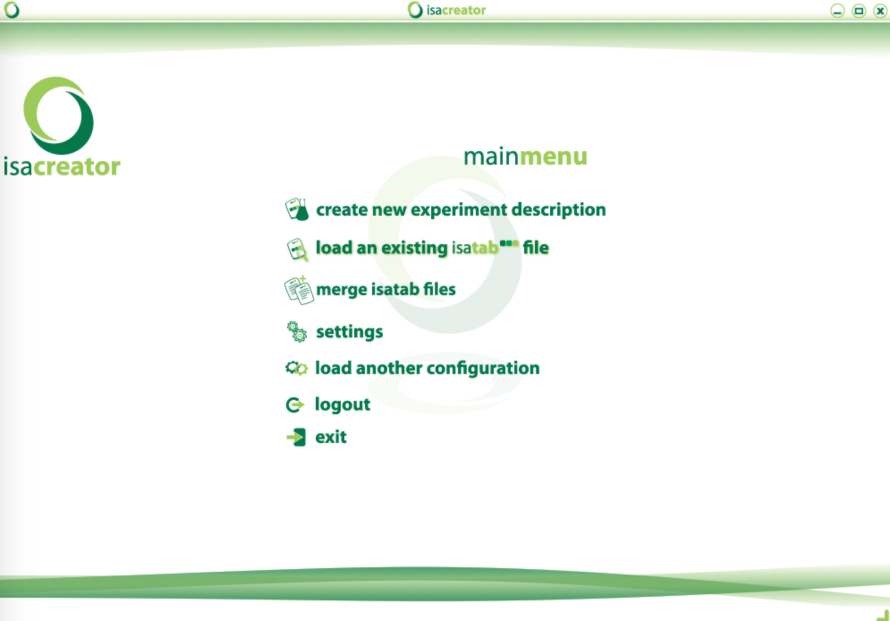
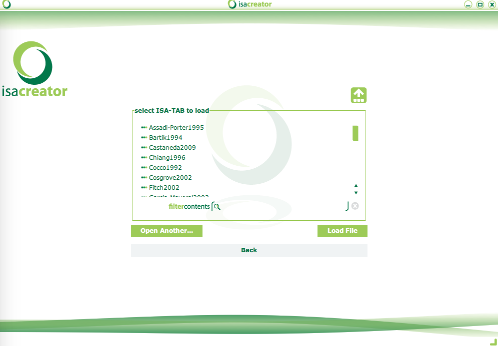
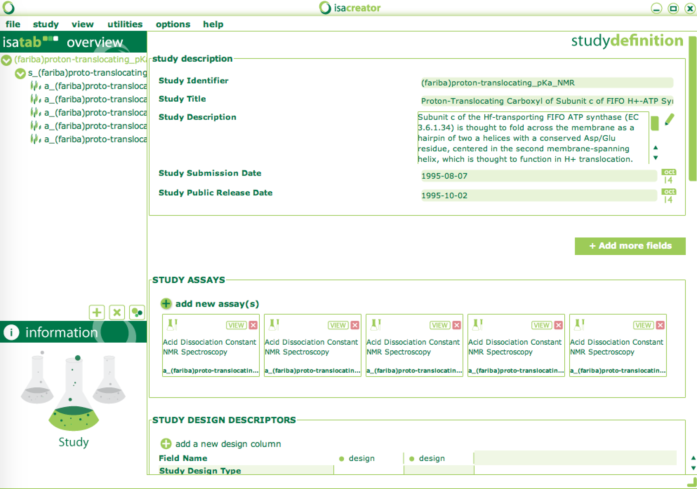

## How to use the configuration 
1.  Use the files here or clone the pka repository:  "clone https://github.com/sobolevnrm/pkacoop.git"
2.  Download [ISACreator](http://www.isa-tools.org/software-suite/) for your platform
2.  Start ISACreator.  You will prompted to log in or create an account.
3.  Point to the pkacoop configuration file:
   1.  At this point you will be directed to the configuration loader dialog: 
   2.  Selct "Open Another" and select the [pKa specific ISAtab configuration directory](isaconfigPChem) file from your cloned repository.  Alternatively, you can copy the [pKa specific ISAtab configuration directory](isaconfigPChem) to the "Configurations" directory of your ISACreator distribution.
   3.  The file will load and take you back to the main menu
4.  Point ISAcreator to the ISAtab files:
   1. Select "Settings" -> "Program File Locations"
   2. Point "ISAtab Location" to the directory containing the [pKa specific ISAtab Files](isa-tab-data).
   3. Select "back" to return to the main menu
5.  Load pKa isatab files:
  1.  From the ISACreator main menu, select "Load an existing isatab file." 
  2.  Select any of the files available in the dialog.  or load the isatab files manually by selecting any one of the isatab directories (e.g. [Assadi-Porter1995](isa-tab-data/Assadi-Porter1995)) from this repository.  This will allow you to view the metadata associated with this author in the overview of the ISAcreator Overview window.  
