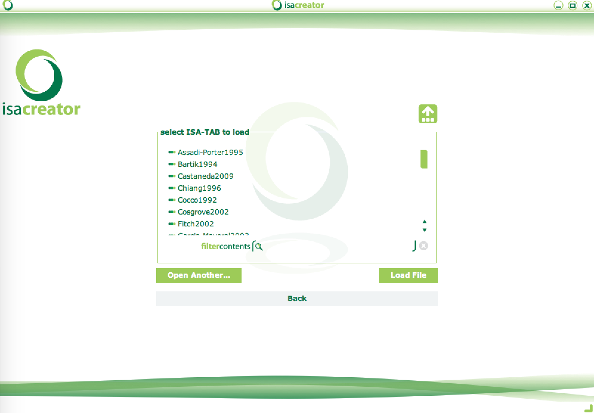
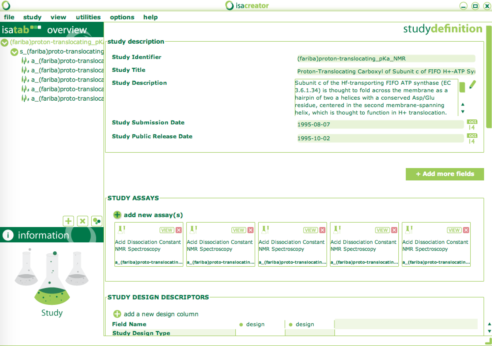

# ISA-Tab files for pKa Cooperative data

## Instructions

1.  Use the files here or clone the pka repository:  "clone https://github.com/sobolevnrm/pkacoop.git"
2.  Download [ISACreator](http://www.isa-tools.org/software-suite/) for your platform
2.  Start ISACreator.  You will prompted to log in or create an account.
3.  Point to the custom configuration file:
	1.  At this point you will be directed to the configuration loader dialog: 
	2.  Select "Open Another" and select the [pKa specific ISAtab configuration directory](isaconfigPChem) file from your cloned repository.  Alternatively, you can copy the [pKa specific ISAtab configuration directory](isaconfigPChem) to the "Configurations" directory of your ISACreator distribution.
	3.  The file will load and take you back to the main menu
4.  Point ISAcreator to the ISAtab files:
	1. Select "Settings" -> "Program File Locations"
	2. Point "ISAtab Location" to the directory containing the [pKa specific ISAtab Files](isa-tab-data).
	3. Select "back" to return to the main menu
5.  Load pKa isatab files:
	1.  From the ISACreator main menu, select "Load an existing isatab file." 
	2.  Select any of the files available in the dialog.  or load the isatab files manually by selecting any one of the isatab directories (e.g. [Assadi-Porter1995](isa-tab-data/Assadi-Porter1995)) from this repository.  This will allow you to view the metadata associated with this author in the overview of the ISAcreator Overview window.  

## Data sources

[ISA-Tab Creator](http://isatab.sourceforge.net/tools.html) configuration files can be found in [isaconfigPChem](isaconfigPChem).

Data from the following manuscripts is provided in the subdirectories:

* [Assadi-Porter1995](Assadi-Porter1995) - Proton-translocating carboxyl of subunit c of F1Fo H(+)-ATP synthase: the unique environment suggested by the pKa determined by 1H NMR. Assadi-Porter FM, Fillingame RH. Biochemistry. 1995 Dec 12;34(49):16186-93.
* [Bartik1994](Bartik1994) - Measurement of the individual pKa values of acidic residues of hen and turkey lysozymes by two-dimensional 1H NMR. Bartik K, Redfield C, Dobson CM. Biophys J. 1994 Apr;66(4):1180-4. <http://www.ncbi.nlm.nih.gov/pmc/articles/PMC1275825/>
* [Castaneda2009](Castaneda2009) - Molecular determinants of the pKa values of Asp and Glu residues in staphylococcal nuclease. Castañeda CA, Fitch CA, Majumdar A, Khangulov V, Schlessman JL, García-Moreno BE. Proteins. 2009 Nov 15;77(3):570-88. doi:[10.1002/prot.22470](http://dx.doi.org/10.1002/prot.22470)
* [Chiang1996](Chiang1996) - The role of acidic amino acid residues in the structural stability of snake cardiotoxins. Chiang CM, Chang SL, Lin HJ, Wu WG. Biochemistry. 1996 Jul 16;35(28):9177-86. doi:[10.1021/bi960077t](http://dx.doi.org/10.1021/bi960077t)
* [Cocco1992](Cocco1992) - Structural comparison of apomyoglobin and metaquomyoglobin: pH titration of histidines by NMR spectroscopy.  Cocco MJ, Kao Y-H, Phillips AT, Lecomte JTJ.  Biochemistry. 1992 Jul;31(28):6481-91.  doi:[10.1021/bi00143a018](http://dx.doi.org/10.1021/bi00143a018)
* [Cosgrove2002](Cosgrove2002) - The catalytic mechanism of glucose 6-phosphate dehydrogenases: assignment and 1H NMR spectroscopy pH titration of the catalytic histidine residue in the 109 kDa Leuconostoc mesenteroides enzyme. Cosgrove MS, Loh SN, Ha JH, Levy HR. Biochemistry. 2002 Jun 4;41(22):6939-45. doi:[10.1021/bi0255219](http://dx.doi.org/10.1021/bi0255219)
* [Fitch2002](Fitch2002) - Experimental pK(a) values of buried residues: analysis with continuum methods and role of water penetration. Fitch CA, Karp DA, Lee KK, Stites WE, Lattman EE, García-Moreno E B. Biophys J. 2002 Jun;82(6):3289-304. <http://www.sciencedirect.com/science/article/pii/S0006349502756701>
* [Garcia-Mayoral2003](Garcia-Mayoral2003) - Dissecting structural and electrostatic interactions of charged groups in alpha-sarcin. An NMR study of some mutants involving the catalytic residues. García-Mayoral MF, Pérez-Cañadillas JM, Santoro J, Ibarra-Molero B, Sanchez-Ruiz JM, Lacadena J, Martínez del Pozo A, Gavilanes JG, Rico M, Bruix M. Biochemistry. 2003 Nov 18;42(45):13122-33. doi:[10.1021/bi0349773](http://dx.doi.org/10.1021/bi0349773)
* [Gooley1998](Gooley1998) - The NMR solution structure and characterization of pH dependent chemical shifts of the beta-elicitin, cryptogein. Gooley PR, Keniry MA, Dimitrov RA, Marsh DE, Keizer DW, Gayler KR, Grant BR. J Biomol NMR. 1998 Nov;12(4):523-34. doi:[10.1023/A:1008395001008](http://dx.doi.org/10.1023/A:1008395001008)
* [Harms2008](Harms2008) - A buried lysine that titrates with a normal pKa: role of conformational flexibility at the protein-water interface as a determinant of pKa values. Harms MJ, Schlessman JL, Chimenti MS, Sue GR, Damjanović A, García-Moreno B. Protein Sci. 2008 May;17(5):833-45. doi:[10.1110/ps.073397708](http://dx.doi.org/10.1110/ps.073397708)
* [Harms2009](Harms2009) - The pK(a) values of acidic and basic residues buried at the same internal location in a protein are governed by different factors. Harms MJ, Castañeda CA, Schlessman JL, Sue GR, Isom DG, Cannon BR, García-Moreno E B. J Mol Biol. 2009 May 29;389(1):34-47. doi:[10.1016/j.jmb.2009.03.039](http://dx.doi.org/10.1016/j.jmb.2009.03.039)
* [Isom2010](Isom2010) - Charges in the hydrophobic interior of proteins. Isom DG, Castañeda CA, Cannon BR, Velu PD, García-Moreno E B. Proc Natl Acad Sci U S A. 2010 Sep 14;107(37):16096-100. doi:[10.1073/pnas.1004213107](http://dx.doi.org/10.1073/pnas.1004213107)
* [Isom2011](Isom2011) - Large shifts in pKa values of lysine residues buried inside a protein. Isom DG, Castañeda CA, Cannon BR, García-Moreno B. Proc Natl Acad Sci U S A. 2011 Mar 29;108(13):5260-5. doi:[10.1073/pnas.1010750108](http://dx.doi.org/10.1073/pnas.1010750108)
* [Kesvatera1996](Kesvatera1996) - Measurement and modelling of sequence-specific pKa values of lysine residues in calbindin D9k. Kesvatera T, Jönsson B, Thulin E, Linse S. J Mol Biol. 1996 Jun 21;259(4):828-39. doi:[10.1006/jmbi.1996.0361](http://dx.doi.org/10.1006/jmbi.1996.0361)
* [Koide2001](Koide2001) - Stabilization of a fibronectin type III domain by the removal of unfavorable electrostatic interactions on the protein surface. Koide A, Jordan MR, Horner SR, Batori V, Koide S. Biochemistry. 2001 Aug 28;40(34):10326-33. doi:[10.1021/bi010916y](http://dx.doi.org/10.1021/bi010916y)
* [Lund-katz2001](Lund-katz2001) - Effects of polymorphism on the microenvironment of the LDL receptor-binding region of human apoE. Lund-Katz S, Wehrli S, Zaiou M, Newhouse Y, Weisgraber KH, Phillips MC. J Lipid Res. 2001 Jun;42(6):894-901. <http://www.jlr.org/content/42/6/894.abstract>
* [Marti2000](Marti2000) - Interhelical ion pairing in coiled coils: solution structure of a heterodimeric leucine zipper and determination of pKa values of Glu side chains. Marti DN, Jelesarov I, Bosshard HR. Biochemistry. 2000 Oct 24;39(42):12804-18. doi:[10.1021/bi001242e](http://dx.doi.org/10.1021/bi001242e)
* [Meyer2011](Meyer2011) - Electrostatic pKa computations in proteins: role of internal cavities. Meyer T, Kieseritzky G, Knapp EW. Proteins. 2011 Dec;79(12):3320-32. doi:[10.1002/prot.23092](http://dx.doi.org/10.1002/prot.23092)
* [Sakurai2007](Sakurai2007) - Principal component analysis of the pH-dependent conformational transitions of bovine beta-lactoglobulin monitored by heteronuclear NMR. Sakurai K, Goto Y. Proc Natl Acad Sci U S A. 2007 Sep 25;104(39):15346-51. doi:[10.1073/pnas.0702112104](http://dx.doi.org/10.1073/pnas.0702112104)
* [Tan1995](Tan1995) - Perturbed pKa values in the denatured states of proteins. Tan YJ, Oliveberg M, Davis B, Fersht AR. J Mol Biol. 1995 Dec 15;254(5):980-92. doi:[10.1006/jmbi.1995.0670](http://dx.doi.org/10.1006/jmbi.1995.0670)
* [Wang1996](Wang1996) - Solution NMR evidence that the HIV-1 protease catalytic aspartyl groups have different ionization states in the complex formed with the asymmetric drug KNI-272. Wang YX, Freedberg DI, Yamazaki T, Wingfield PT, Stahl SJ, Kaufman JD, Kiso Y, Torchia DA. Biochemistry. 1996 Aug 6;35(31):9945-50. doi:[10.1021/bi961268z](http://dx.doi.org/10.1021/bi961268z)
* [Webb2010](Webb2010) - Remeasuring HEWL pK(a) values by NMR spectroscopy: methods, analysis, accuracy, and implications for theoretical pK(a) calculations. Webb H, Tynan-Connolly BM, Lee GM, Farrell D, O'Meara F, Søndergaard CR, Teilum K, Hewage C, McIntosh LP, Nielsen JE. Proteins. 2011 Mar;79(3):685-702. doi:[10.1002/prot.22886](http://dx.doi.org/10.1002/prot.22886)
* [Wolff2001](Wolff2001) - Histidine pK(a) shifts and changes of tautomeric states induced by the binding of gallium-protoporphyrin IX in the hemophore HasA(SM). Wolff N, Deniau C, Létoffé S, Simenel C, Kumar V, Stojiljkovic I, Wandersman C, Delepierre M, Lecroisey A. Protein Sci. 2002 Apr;11(4):757-65. doi:[10.1110/ps.3630102](http://dx.doi.org/10.1110/ps.3630102)
* [Zheng2009](Zheng2009) - Analysis of the electrochemistry of hemes with E(m)s spanning 800 mV. Zheng Z, Gunner MR. Proteins. 2009 May 15;75(3):719-34. doi:[10.1002/prot.22282](http://dx.doi.org/10.1002/prot.22282)
